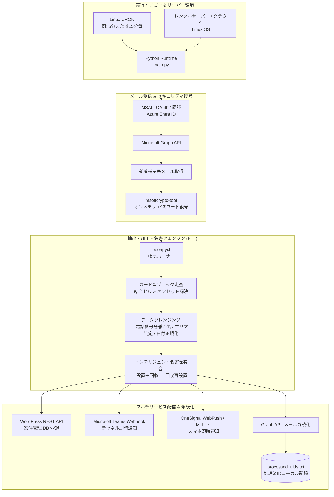
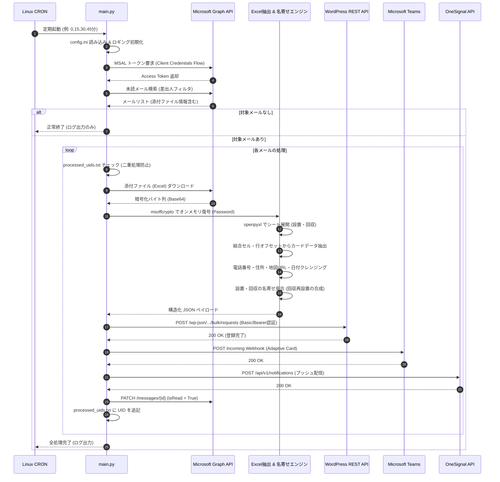

# メール添付Excel自動処理・REST API/Teams/WebPush通知システム
## Email-Attached Encrypted Excel Processor & Multi-Service Notifier

<div align="center">


### **PCを閉じていても、メール受信からDB登録・チャット通知まで全自動。**
**暗号化Excel帳票のオンメモリ復号・非定型カード解析・高度な名寄せ突合を実現したエンタープライズ業務自動化パイプライン**

</div>

---

## 📖 目次
1. [システム概要](#-システム概要)
2. [導入成果と定量的効果 (ROI)](#-導入成果と定量的効果-roi)
3. [開発の背景と課題](#-開発の背景と課題)
4. [なぜ GAS や Power Automate では駄目だったのか？（技術選定の核心）](#-なぜ-gas-や-power-automate-では駄目だったのか技術選定の核心)
5. [主要機能一覧](#-主要機能一覧)
6. [システムアーキテクチャ & 処理フロー](#-システムアーキテクチャ--処理フロー)
7. [こだわりのコアロジック (Engineering Highlights)](#-こだわりのコアロジック-engineering-highlights)
8. [設定ファイル (`config.ini`) 仕様](#-設定ファイル-configini-仕様)
9. [環境構築 & サーバーデプロイ手順](#-環境構築--サーバーデプロイ手順)
10. [日常運用 & トラブルシューティング](#-日常運用--トラブルシューティング)
11. [ライセンス & 開発者](#-ライセンス--開発者)

---

## 💡 システム概要

本システムは、自治体・委託元から定期的に送信されてくる**「パスワード付き暗号化 Excel（.xlsx）」**が添付された指示書メールを自動監視し、添付ファイルの復号・非定型帳票解析・名寄せ突合処理を実行した上で、**外部データベース (REST API / WordPress / MySQL)** への一括登録、**Microsoft Teams** へのリッチ通知、および **OneSignal (WebPush / スマホアプリ)** への即時プッシュ通知までを完全自動で完結させる Python ベースのバックエンド自動化システムです。

レンタルサーバー（メールサーバーと同居環境）上に配置し、**Linux CRON** により定期自律実行させることで、**「作業用 PC の電源を切っていても 24 時間 365 日止まらずに稼働する」** 堅牢な運用環境を実現しています。

```
[自治体からの依頼メール (パスワード付Excel添付)]
                     ⬇️
[Microsoft Graph API 経由で新着メールを自動検知 & 取得]
                     ⬇️
[msoffcrypto によるオンメモリ復号 (ディスクに平文を残さない)]
                     ⬇️
[openpyxl による非定型カード型レイアウト & 結合セルの動的走査]
                     ⬇️
[インテリジェント名寄せ突合 (設置・回収の複合タスク合成 / エリア自動判定)]
                     ⬇️
   +-----------------+-----------------+-----------------+
   |                 |                 |                 |
[REST API 登録]    [Teams 通知]     [OneSignal Push]   [メール既読化]
(外部DB/WordPress)  (カード型サマリー) (現場スタッフスマホ) (二重処理防止)
```

---

## 📈 導入成果と定量的効果 (ROI)

本システムの導入により、毎日発生していた神経を使うルーティン作業が完全に消滅しました。

| 評価指標 | 導入前（手動オペレーション） | 導入後（本システム） | 改善効果 |
| :--- | :--- | :--- | :--- |
| **作業所要時間** | **毎日約 40 分**（1回5分 × 1日8回） | **ほぼ 0 分**（完全自動化） | **月間約 14 時間の工数を削減** |
| **処理リードタイム** | メール到着後、担当者が気付くまで **10〜60 分** の待機遅延 | メール着信から **約 5 秒〜15 秒** で全連携完了 | 現場対応開始までの初動が大幅に加速 |
| **転記・確認ミス** | パスワード誤入力、結合セルの見落とし、住所の入力ミス | プログラムによる完全な正規化・検証 | **人的転記ミスを 0 件に撲滅** |
| **PC・人手への依存** | 担当者が PC の前で待機、外出時・休暇時は処理停止 | サーバー上の CRON で常時稼働 | **PC シャットダウン中や休日も完全自律** |

---

## 🎯 開発の背景と課題

### 1. 業務の背景（有害鳥獣対策・現場作業管理）
現場では、自治体から送付される「有害鳥獣捕獲（わな設置 / わな回収）」の作業指示書をもとに、作業員が現場（山林や農地、住宅地周辺）へ出動します。
指示書はセキュリティ保護の観点から**「パスワード保護付きの Excel ファイル」**としてメール送信され、1日数回〜1時間に1回不定期に届くため、常にメールボックスを監視し続ける必要がありました。

### 2. 解決すべき現場の課題
- **煩雑な手動ステップ**:
  1. メーラーを開いて新着指示書メールを確認
  2. 添付 Excel をダウンロードし、パスワードを入力して解凍・閲覧
  3. カード状に並んだ複雑なレイアウトから、発注コード、氏名、住所、希望日、特記事項をコピー
  4. 現場管理システム（REST API / DB）のフォームに1項目ずつ手作業でペースト
  5. 作業員連絡用の Microsoft Teams チャネルへ案件概要を手動投稿
  6. 現場スタッフのスマホアプリへプッシュ通知を送信
- **精神的負荷と作業の中断**:
  集中して他の業務を行っていても、1時間に1回メール確認のために作業を中断せざるを得ず、担当者の生産性を著しく阻害していました。

---

## ⚡ なぜ GAS や Power Automate では駄目だったのか？（技術選定の核心）

当初は Google Workspace (GAS) や Microsoft 365 (Power Automate) などのノーコード・ローコード基盤での実装を検討・検証しましたが、**日本の実務帳票特有の複雑さとインフラ制約により実現不可能**でした。Python を選択した決定的な理由は以下の通りです。

```
+--------------------------------------------------------------------------------------------------+
|                            自動化プラットフォームの比較検証                                      |
+--------------------------+---------------------+--------------------+----------------------------+
| 比較要件                 | Google Apps Script  | Power Automate     | 本システム (Python on CRON)|
+--------------------------+---------------------+--------------------+----------------------------+
| 暗号化Excelの復号        | ❌ 実装不可 (非対応)| ⚠️ サードパーティ要 | ✅ msoffcrypto で完全復号  |
| カード型非定型セルの解析 | ❌ スプレッド変換要 | ❌ テーブル定義必須| ✅ openpyxl で結合・オフセット走査|
| 設置・回収の名寄せ複合化 | ⚠️ 制限時間超過(6分)| ❌ フロー構築困難  | ✅ Python 内包表記・辞書突合|
| ローカルPC停止時の自律性 | ✅ クラウド動作     | ⚠️ デスクトップ版はPC必須| ✅ Linux レンタルサーバー動作 |
| 外部連携の自由度         | ⚠️ Google系中心     | ⚠️ コネクタ従量課金| ✅ Requests で任意のREST API|
| 運用ランニングコスト     | 無料〜              | 高額 (有償ライセンス) | 既存サーバー流用で **追加 0 円**|
+--------------------------+---------------------+--------------------+----------------------------+
```

### 1. パスワード保護付き暗号化 Excel（.xlsx）の壁
自治体から送られてくる Excel は暗号化（Standard / Agile Encryption）が施されています。
- **GAS**: Office ファイルのバイナリ暗号化を解く手段が存在せず、Google ドライブ上で開くことすら不可能。
- **Power Automate**: 標準のアクションではパスワード付き Excel を開けず、プレミアムコネクタやサードパーティ製サービスが必要。
- **Python の解決策**: `msoffcrypto-tool` を使用することで、パスワードを指定して**メモリ上で即座に復号**。一時ディスクへ平文ファイルを保存する必要すらなく、極めて安全に処理できます。

### 2. 「テーブル（表形式）」ではない、カード型非定型レイアウトの壁
Excel は一般的な1行1レコードのテーブル（ListObject）ではなく、**「12行または10行を1ブロックとしたカード（名刺）状のブロック」**が縦に並び、さらにセル同士が複数列にわたって結合されているレイアウトでした。
- **Power Automate**: Excel コネクタはテーブル定義されているデータしか読み出せないため、完全に解析不能。
- **Python の解決策**: `openpyxl` を用いて、`merged_cells.ranges` から結合セルの左上（マスター値）を自動判定する独自関数 `get_cell_value()` を構築。行オフセットと列マッピングテーブルを組み合わせ、どんなに複雑な帳票レイアウトでもミリ秒単位で正確にパースします。

### 3. 「設置」と「回収」をインテリジェントに突合する名寄せロジックの壁
業務ルール上、「同一人物」「同一指示書番号」「同日送付」の設置と回収は、別々の依頼として扱うのではなく、**「わな回収再設置」という1つの複合親タスク**に集約し、その下に2つの子詳細タスクを紐付ける必要があります。
ノーコードのループ処理や条件分岐ブロックでこの複雑な突合・除外集合管理を行うと、フローの破綻やタイムアウトを引き起こします。Python のハッシュマップ（辞書）と集合演算により、数千行のデータでも 0.01 秒で突合を完了します。

### 4. ローカル PC シャットダウン時の完全自律稼働
Power Automate for Desktop などのデスクトップ RPA は「実行用の PC を常に起動しておかなければならない」という致命的な弱点があります。
本システムは、**自社のメールサーバーや Web サーバーが稼働する Linux レンタルサーバー上にスクリプトをデプロイし、OS 標準の CRON で動作**します。PC を閉じて退社した後も、夜間・早朝・休日に届く指示書を完全に自動処理します。

---

## 🚀 主要機能一覧

| 機能分類 | 機能名 | 詳細説明 |
| :--- | :--- | :--- |
| **メール受信** | **Microsoft Graph API 連携** | Azure AD (Entra ID) の OAuth2 クライアント資格情報フローを採用。POP3/IMAP の認証制限（モダン認証必須化）に完全対応し、対象差出人・件名から添付ファイルを高速抽出。 |
| **セキュリティ** | **オンメモリ Excel 復号** | パスワード付き暗号化 Excel を `io.BytesIO` バッファ上でメモリ復号。ディスクに機密ファイルの平文を残さないセキュア設計。 |
| **データ抽出** | **非定型カード走査エンジン** | 依頼種別（設置: 12行間隔 / 回収: 10行間隔）に応じた行オフセット走査。結合セルのアンラップ、不可視文字（BOM/ゼロ幅スペース）除去、全角半角 NFKC 正規化。 |
| **ビジネスロジック** | **インテリジェント名寄せ突合** | 同一人物・同一指示書番号・同日送付の「設置」と「回収」を検知し、「わな回収再設置」親依頼へ自動統合。単独の依頼は独立した親依頼として生成。 |
| **データクレンジング** | **高度な電話番号・住所解析** | カッコ書きの名義（例: `(本人)`, `【携帯】`）を抽出し、複数電話番号をメイン・サブへ分離。住所から市名・町名辞書を参照して「エリアA/B/C」を自動判定し、Google Maps リンクを自動生成。 |
| **外部連携 (DB)** | **REST API バルク登録** | WordPress (カスタム API) / 外部 MySQL へ、親子関係を保持した JSON ペイロードを一括登録。MySQL 用の日付フォーマット変換にも対応。 |
| **外部連携 (Chat)** | **Microsoft Teams リッチ通知** | Incoming Webhook を利用し、案件ID、依頼者名、住所、Google Maps リンク、作業種別、特記事項を美しくレイアウトした Adaptive Card / Message Card を即時投稿。 |
| **外部連携 (Push)** | **OneSignal プッシュ通知** | 現場作業員のスマートフォン（iOS / Android / Web）へ、緊急度や作業エリアに応じたプッシュ通知を一斉配信。 |
| **運用・保全** | **冪等性 (二重処理防止)** | `processed_uids.txt` によるメッセージ ID 管理と、Graph API のメール既読フラグ更新により、スクリプトが何度再実行されても絶対に二重登録を起こさない安全設計。 |

---

## 🏗️ システムアーキテクチャ & 処理フロー

### 1. 全体アーキテクチャ構成図



---

### 2. エンドツーエンド処理シーケンス図



---

## 💎 こだわりのコアロジック (Engineering Highlights)

### 1. ディスクに残さないオンメモリ復号
セキュリティ上、パスワード保護された行政帳票を平文ファイルとしてサーバーのファイルシステムに書き出すことは情報漏洩リスクとなります。
本システムでは、Python の `io.BytesIO` ストリームを `msoffcrypto` に直接渡し、復号後のバイナリをそのまま `openpyxl.load_workbook` に受け渡すことで、**サーバーディスク上に一切の平文キャッシュを残さないゼロファイル復号**を実現しています。

```python
# 実装抜粋: オンメモリ復号パイプライン
decrypted_stream = io.BytesIO()
file_obj = msoffcrypto.OfficeFile(encrypted_stream)
file_obj.load_key(password=excel_password)
file_obj.decrypt(decrypted_stream)
decrypted_stream.seek(0)
workbook = openpyxl.load_workbook(decrypted_stream, data_only=True)
```

### 2. 結合セルのマスター値フォールバック (`get_cell_value`)
Excel 上で複数セルが結合されている場合、openpyxl では**「結合範囲の左上セル」にしか値が保持されず、それ以外の結合内セルを参照すると `None` が返却される**という仕様があります。
本システムでは、参照したセルが結合範囲に含まれているかを逆引きし、自動的に範囲の左上セルの値をフェッチするヘルパー関数を実装しています。

```python
# 結合セルの左上を動的探索
for merged_range in sheet.merged_cells.ranges:
    if merged_range.min_row <= cell.row <= merged_range.max_row and \
       merged_range.min_col <= cell.column <= merged_range.max_col:
        top_left_cell = sheet.cell(row=merged_range.min_row, column=merged_range.min_col)
        raw_value = top_left_cell.value
        break
```

### 3. 電話番号・名義の高度な正規化 (`process_phone_number`)
帳票内の電話番号セルには、「`090-1234-5678(本人)`」「`048-000-0000【自宅】/090-0000-0000(携帯)`」のように、日本語の名義や複数番号が混在して記入されます。
正規表現パターンと Unicode 正規化（NFKC）を駆使し：
- カッコ内の名義情報を抽出して備考へ分離
- 日本の国内番号（9〜11桁）を厳格にバリデーション
- 1つ目をメイン電話番号、2つ目以降を追加電話番号として分離整形

### 4. Excel の歴史的うるう年バグ（1900年バグ）の吸収
Excel は Lotus 1-2-3 との互換性のため、「存在しない 1900年2月29日（シリアル値 60）」をうるう年として計算してしまう有名な仕様があります。
シリアル値を Python の `datetime` に変換する際、シリアル値 60 を境にした 1 日のオフセット補正を自動適用し、日付のズレを完全に防いでいます。

---

## ⚙️ 設定ファイル (`config.ini`) 仕様

本システムは、コードを書き換えることなくすべての動作パラメータを `config.ini` から一括制御できます。

```ini
[Files]
# ログおよび処理済みメッセージUIDの保存先
LOG_DIR = ./logs
TEMP_DIR = ./temp
PROCESSED_EMAILS_FILE = ./processed_uids.txt

[Email]
# Microsoft Entra ID (旧 Azure AD) アプリケーション登録情報
TENANT_ID = YOUR_AZURE_TENANT_ID
CLIENT_ID = YOUR_AZURE_CLIENT_ID
CLIENT_SECRET = YOUR_AZURE_CLIENT_SECRET
TARGET_EMAIL_ADDRESS = recipient@example.com      # 受信トレイを監視するアドレス
TARGET_SENDER = sender@city.example.lg.jp         # 指示書を送信してくる差出人

[Excel]
PASSWORD = YOUR_EXCEL_PASSWORD                    # 添付Excelの復号パスワード
SHEET_NAME_INSTALL = 設置依頼シート名             # 設置データが記載されているシート名
SHEET_NAME_RECOVERY = 回収依頼シート名            # 回収データが記載されているシート名

[API]
# 外部 REST API (WordPress等) の接続設定
MAP_URL_BASE = https://www.google.com/maps/search/?api=1&query=
WP_BASE_URL = https://your-domain.example.com
WP_BULK_REQUESTS_ENDPOINT = /wp-json/custom-api/v1/bulk/requests
WP_APP_USERNAME = your_wp_application_user
WP_APP_PASSWORD = your_wp_application_password

[Teams]
# Microsoft Teams Incoming Webhook URL
WEBHOOK_URL = https://your-tenant.webhook.office.com/webhookb2/...
DASHBOARD_URL = https://your-domain.example.com/admin/

[OneSignal]
# OneSignal プッシュ通知設定
APP_ID = YOUR_ONESIGNAL_APP_ID
API_KEY = YOUR_ONESIGNAL_REST_API_KEY
TARGET_URL = https://your-domain.example.com/mobile-app/
```

---

## 🛠️ 環境構築 & サーバーデプロイ手順

### 1. サーバー要件
- OS: **Linux**（Ubuntu, Debian, AlmaLinux, Rocky Linux, CentOS 等 / 一般的なレンタルサーバーの SSH 環境）
- 言語: **Python 3.8 以上** (推奨: Python 3.10+)
- 権限: スクリプト実行権限および CRON 登録権限

### 2. インストール

```bash
# 1. サーバーへリポジトリをクローン
git clone https://github.com/watawatan1984/email-excel-webhook-notifier.git
cd email-excel-webhook-notifier

# 2. 依存ライブラリのインストール
pip3 install msal requests openpyxl msoffcrypto-tool

# 3. 設定ファイルの作成
cp config.ini.example config.ini
vi config.ini  # 各種 API キー・認証情報を設定
```

### 3. Azure AD (Microsoft Entra ID) の準備
Microsoft Graph API を利用するため、Azure ポータルにて以下の設定を行います：
1. **アプリの登録**: 「新規登録」を行い、`テナント ID` と `クライアント ID` を取得。
2. **証明書とシークレット**: 「新しいクライアント シークレット」を発行し、値を `config.ini` の `CLIENT_SECRET` に設定。
3. **API のアクセス許可**:
   - `Microsoft Graph` -> `アプリケーションの許可`
   - `Mail.ReadWrite`（メールの取得および既読フラグの更新）
   - 「管理者の同意を与えます」をクリックして承認を完了。

### 4. 手動動作テスト

```bash
# スクリプトの手動実行テスト
python3 main.py
```
ログファイル (`logs/app.log`) またはコンソールに以下が出力されれば成功です：
```text
2026-09-04 22:00:00 - INFO - main - main - 1100 - 新着メールの確認を開始します...
2026-09-04 22:00:02 - INFO - main - process_email - 850 - 対象メールを受信: 1 件
2026-09-04 22:00:03 - INFO - main - extract_master_excel_data - 587 - Excelファイル読み込み成功
2026-09-04 22:00:05 - INFO - main - post_requests_to_wp - 720 - REST API への一括登録が完了しました (件数: 4)
2026-09-04 22:00:06 - INFO - main - send_teams_notification - 780 - Teams 通知を送信しました
2026-09-04 22:00:07 - INFO - main - main - 1115 - スクリプトを正常終了します。
```

### 5. CRON 定期実行の設定
サーバーの CRON に登録し、無人定期実行を有効化します。

```bash
# crontab の編集
crontab -e

# 設定例: 毎時 0分, 15分, 30分, 45分 (15分おき) に定期実行
*/15 * * * * cd /home/your-user/email-excel-webhook-notifier && /usr/bin/python3 main.py >> logs/cron.log 2>&1
```

---

## 🔧 日常運用 & トラブルシューティング

### 1. ログの監視
リアルタイムでの動作ログ監視コマンド：
```bash
tail -f logs/app.log
```

### 2. よくあるエラーと対処法

| 現象・エラーメッセージ | 原因 | 対処法 |
| :--- | :--- | :--- |
| `Authorization_IdentityNotFound` | テナントID、クライアントIDの誤り、またはメールアドレス不一致 | `config.ini` の `[Email]` セクションの各値が Azure ポータルと一致しているか再確認してください。 |
| `InvalidClientSecret` | クライアントシークレットの有効期限切れ | Azure ポータルでシークレットを再発行し、`config.ini` の `CLIENT_SECRET` を更新してください。 |
| `Excel添付なし ... 処理済みとしてマーク` | 業務連絡など、Excel が添付されていないメールを受信 | 異常ではありません。スクリプトが自動判別して既読化し、無限ループを回避しています。 |
| `KeyError: 'SHEET_NAME_...'` | Excel のシート名が変更された | 発注元のシート名変更に合わせて `config.ini` の `SHEET_NAME_INSTALL` などの値を更新してください。 |

### 3. 過去メールの再処理方法
一度処理したメールをテストや障害復旧等で再処理したい場合は、`processed_uids.txt` をエディタで開き、該当するメールのメッセージ ID（または行全体）を削除して再度スクリプトを実行してください。

---

## 📄 ライセンス & 開発者

- **ライセンス**: [MIT License](LICENSE)
- **開発者**: [watawatan1984](https://github.com/watawatan1984)
- **リポジトリ**: [https://github.com/watawatan1984/email-excel-webhook-notifier](https://github.com/watawatan1984/email-excel-webhook-notifier)